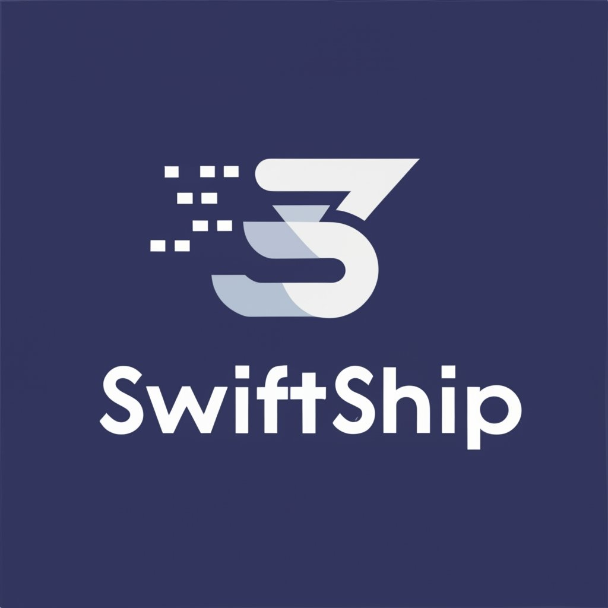

<!--suppress ALL -->
<p align="center">
  <br/>
</p>


[](https://packagist.org/packages/zfhassaan/payfast)
[](LICENSE)
[](https://hits.seeyoufarm.com)
[](https://packagist.org/packages/zfhassaan/payfast)

# SwiftShip
### Supported Companies

<ul>
  <li><a href="https://www.tcsexpress.com" target="_blank">TCS</a></li>
  <li><a href="https://www.leopardscourier.com" target="_blank">Leopard Courier Service (LCS)</a></li>
</ul>

### Disclaimer
* This software package is unofficial and is not endorsed or affiliated with any official shipping service.
* Initially All the services will support creating a COD booking and tracking.
* It is designed for single-service integration only; multiservice functionality is not currently enabled.
* Please be aware that this project is in an active development phase and may undergo changes and updates.
* We have plans to integrate multiple shipping services in future releases, allowing for parallel usage and expanded functionality.

#### Planned Support For:
<div style="display:flex">
  
  
  
  
  
</div>

#### Introduction
Welcome to SwiftShip, your gateway to effortless courier company integration within the Laravel ecosystem.
Seamlessly connect with top-tier shipping services like TCS, DHL, LCS, Trax, and Leopard, all designed to supercharge your shipping operations. Experience real-time tracking, cost optimization, and an intuitive interface, all wrapped in a package built to elevate your eCommerce or logistics platform. Join us on the journey to a faster, more efficient shipping experience, with SwiftShipLaravel as your trusted partner.

#### Intended Audience
SwiftShipLaravel is tailored for Laravel developers, eCommerce businesses, and logistics professionals seeking efficient courier company integration. Whether you're a seasoned developer looking to streamline shipping services or an organization aiming to enhance your logistics operations, our package is designed to meet your needs. Explore the capabilities of SwiftShipLaravel and elevate your shipping experience today.
The package only uses the COD apis for booking the courier and tracking.

#### Requirements

Before utilizing the SwiftShip Laravel Package, ensure you have the necessary information from your chosen courier service. Here are the required fields for TCS:

- X-IBM-Client-Id
- userName
- Password

#### Installation

You can effortlessly install the package using the following Laravel Composer command:

```bash
composer require zfhassaan/swiftship
```

Next, add the SwiftShip service provider to your `config/app.php` file:

```php
/*
 * Package Service Providers...
 */
...
\Zfhassaan\SwiftShip\Provider\SwiftShipServiceProvider::class,
...
```

In the same `config/app.php` file, under the 'aliases' section, add the SwiftShip alias:

```php 
...
'aliases' => Facade::defaultAliases()->merge([
    ...
    'SwiftShip' => \zfhassaan\swiftship\Facade\SwiftShipFacade::class,
])->toArray(),
...
```

Once these steps are completed, publish the configuration file to your Laravel application:

```bash 
php artisan vendor:publish --tag=swift-ship-config
```

``.env`` variables to be used: 

```bash 
# SWIFTSHIP COURIER PACKAGE
SWIFTSHIP_TCS_CLIENT_ID=
SWIFTSHIP_TCS_BASE_URL=
SWIFTSHIP_TCS_USERNAME=
SWIFTSHIP_TCS_PASSWORD=
SWIFTSHIP_TCS_TRACKING_URL=
```


#### Usage

To use the SwiftShip Laravel Package, ensure you declare all the required environment variables for your selected courier service. Currently, only TCS is supported for creating COD orders with a value of 0 or a specified amount. The package also includes a comprehensive tracking system for TCS.

Each courier service follows the naming convention of `ServiceNameClient`, such as `LCSClient` or `TCSClient`. Here's an example of Creating a TCS shipment:

```php
use Zfhassaan\SwiftShip\SwiftShip;
use Zfhassaan\Swiftship\Couriers\LCS\TCS\TCSClient;

class YourController extends Controller
{
    public function TrackLCSShipment($trackingNumber)
    {
        $swiftShip = new SwiftShip();
        $courier = $swiftShip->setCourierClient(new TCSClient());
        $result =  $swiftShip->createBooking($request->all());
        return json_decode($result);
    }
}
```

##### Tracking Orders:

To track orders, here's an example using the TCS courier client:

```php
use Zfhassaan\Swiftship\Couriers\LCS\TCS\TCSClient;
use Zfhassaan\SwiftShip\SwiftShip;

class YourController extends Controller
{
    public function index(Request $request)
    {
        $swiftShip = new SwiftShip();
        $courier = $swiftShip->setCourierClient(new TCSClient());
        $result = $swiftShip->trackShipment($request->consignmentNo);
        return json_decode($result);
    }
}
```

Now, you're all set to leverage the SwiftShip Laravel Package for streamlined courier integration and order tracking in your Laravel application.
